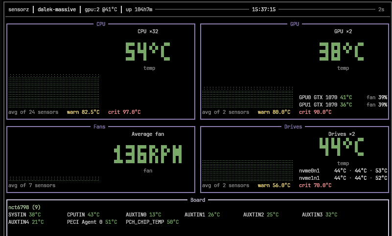

# sensorz

A terminal monitor for the two things that actually make a machine uncomfortable:
how hot it is, and whether its fans are still spinning.



sensorz shows temperatures and fan speeds, and nothing else. There is no CPU
utilisation graph, no memory bar, no network throughput: every reading on screen
is one you can act on — run something cooler, open the case, clean a filter.

Four boxes, one per class of sensor, each with one number and one graph:

| Box | Reading |
| --- | --- |
| **CPU** | the mean temperature across every CPU temperature channel — the package sensor on each socket and every core within it |
| **GPU** | the mean of the readable cards' temperatures, with a line per card underneath |
| **Fans** | the mean RPM across every fan the machine reports |
| **Drives** | the mean of every drive that reports a temperature, with a line per drive |
| **Board** | the motherboard sensors that belong to no other box: the Super-I/O thermistors, the chipset, the CPU as the board's PECI controller reads it |

One graph per box, down the left. A machine with sixteen cores, four GPUs and
eleven case fans still shows four numbers, not thirty-one.

## Requirements

**Linux, and the kernel's hardware monitoring interface.**

sensorz reads `/sys/class/hwmon`, which is the kernel's `hwmon` subsystem. If
your kernel has it compiled in — every distribution kernel does — there is
nothing to install and no root is needed: the sysfs files are world-readable
(`-r--r--r--`).

```sh
# is anything there?
ls /sys/class/hwmon
cat /sys/class/hwmon/hwmon*/name
```

**Kernel drivers that supply the readings.** These are almost always loaded
already; if a box is missing its sensors, this is the first place to look.

| Sensor | Driver |
| --- | --- |
| Intel CPU temperatures | `coretemp` |
| AMD CPU temperatures | `k10temp` (older), `zenpower` |
| Laptop/SoC package temperature | `cpu_thermal`, `soc_thermal` |
| Motherboard Super-I/O, case fans | `nct6775`, `nct6798`, `it87` |
| NVMe drive temperatures | `nvme` |
| AMD GPU temperatures | `amdgpu` |
| Intel GPU temperatures | `i915`, `xe` |
| Wi-Fi card temperature | `iwlwifi` |
| NVIDIA GPU temperatures | the proprietary driver's NVML library, or `nouveau` |

**A C compiler, for cgo.** The NVML bindings are cgo, so the build needs `gcc`
or `clang` and cgo enabled. The bindings ship their own `nvml.h`, so you do not
need the CUDA toolkit; if there is no NVIDIA driver on the machine, NVML simply
fails to initialise at runtime and sensorz falls back to the sysfs backends.

**Go 1.26 or newer** to build from source. There is no prebuilt binary in this
repository yet.

Nothing else. No configuration file, no daemon, no root, no network access.

## Install

```sh
make            # builds ./sensorz in the repository root
make run        # builds and runs it
make install    # go install, into $GOBIN or ~/go/bin
```

`make help` lists every target. `make check` is what CI runs: gofmt, `go vet`
and the tests.

## Run

```sh
./sensorz
```

| Key | |
| --- | --- |
| `↑` `↓`, `tab` | cycle the panel cursor |
| `a` | show every hwmon channel, not just the important ones |
| `p` | pause the history, so a spike can be read without it moving |
| `r` | clear the history and start again |
| `?` | toggle the help line |
| `q` | quit |

| Flag | |
| --- | --- |
| `-interval 2s` | how often to sample |
| `-history 256` | samples retained per graph |
| `-proc /proc` | procfs mount point, for testing against a fixture |
| `-all-sensors` | start with every channel listed |
| `-list-sensors` | print what was found and exit — the first thing to run when a reading is missing |
| `-version` | print the version |

## How it reads things

**hwmon.** The kernel exposes every temperature and fan tachometer as a
directory under `/sys/class/hwmon/hwmonN`. Each file is a millidegree or a
RPM count, and the sibling `*_label`, `*_crit` and `*_max` files say what it is
and where its limits are. Channels are matched to their chip by the `name` file,
so `nct6798` is a Super-I/O chip, `coretemp` is a CPU, and `nvme` is a drive.

The readings a board exposes and does not populate are hidden: on an NCT6798,
`PCH_CPU_TEMP` and `PCH_CHIP_CPU_MAX_TEMP` read a fixed `0.0` because no
thermistor is wired to them, and a real NTC thermistor at room temperature
cannot read exactly zero. The PECI calibration channel is hidden for a different
reason — it reports the offset the firmware applies, which is a number the board
picked at boot rather than a temperature. `acpitz` is hidden because it merely
mirrors a sensor the Super-I/O already reports. `-all-sensors` shows them anyway.

**GPUs** are read through whichever of three backends works:

1. **NVML** for NVIDIA cards under the proprietary driver. There is no sysfs
   route to a GeForce temperature at all: the driver registers no hwmon device,
   which is why this backend is mandatory rather than optional on NVIDIA.
2. **`/sys/class/drm/card*/device`** for everything that exports telemetry
   through sysfs — amdgpu, recent i915, nouveau, and the SoC GPUs.
3. **PCI** as a fallback, which identifies a display adapter that exposes no
   telemetry so it can be listed as present rather than silently missing.

A card whose driver exposes no temperature is reported as such and left out of
the average, rather than drawn as a permanently idle `0°C`.

**Drives** are matched from their hwmon chip back to the `/dev` node by
resolving both symlinks to the same PCI device, which is how an NVMe controller's
temperature gets to the right drive without decoding slot numbers.

## Colours

A reading is drawn pale green while it is cool, warming continuously through
yellow as it approaches its warning point, and red at its critical temperature.
The ramp turns at the warning point rather than at zero, so a CPU at 40 °C on a
part that dies at 100 °C is not already half way to a problem.

Thresholds come from the hardware rather than from a table: a channel's own
`tempN_crit`, where the driver reports one, sets the ceiling for its graph and
the warning point is derived from it.

The boxes are all the same dark pale purple. Chrome that means something
competes with the readings for attention, and the only colour that should carry
information is the one a reading is drawn in.

## Go libraries

Direct dependencies:

| Library | Version | Why |
| --- | --- | --- |
| [charmbracelet/bubbletea](https://github.com/charmbracelet/bubbletea) | v1.3.10 | the TUI runtime: input, resize, alt screen, the message loop |
| [charmbracelet/lipgloss](https://github.com/charmbracelet/lipgloss) | v1.1.0 | styling, colour profiles (truecolour on a dark terminal, a readable palette on a light one), panel borders and width measurement |
| [mattn/go-runewidth](https://github.com/mattn/go-runewidth) | v0.0.30 | display width for truncation and padding, so a value is never cut mid-glyph |
| [prometheus/procfs](https://github.com/prometheus/procfs) | v0.22.0 | reads `/proc/stat` for the core count and `/proc/diskstats` plus `/sys/block` for the drive list |
| [NVIDIA/go-nvml](https://github.com/NVIDIA/go-nvml) | v0.13.4-0 | NVML bindings for NVIDIA GPU temperature, fan and power. **cgo**: needs a C compiler, and fails at runtime — harmlessly — when there is no NVIDIA driver |

Pulled in transitively by bubbletea and lipgloss: `charmbracelet/x/ansi`,
`charmbracelet/x/cellbuf`, `charmbracelet/x/term`, `charmbracelet/colorprofile`,
`muesli/ansi`, `muesli/cancelreader`, `muesli/termenv`,
`lucasb-eyer/go-colorful`, `rivo/uniseg`, `mattn/go-isatty`,
`clipperhouse/uax29`, `golang.org/x/sys`, `golang.org/x/text`, and
`aymanbagabas/go-osc52` for OSC 52 clipboard support.

The charts are drawn in this repository: `internal/ui/braille.go` is a 2×4 braille
dot canvas with a Bresenham line plot and a resampler that keeps peaks
surviving downsampling, and `internal/ui/bigfont.go` is the 3×5 bitmap font the
headline figures are drawn from. `go-runewidth` is the only reason a degree sign
counts as one cell wide.

## Development

```sh
make check      # gofmt, go vet, go test ./...
make race       # the tests under the race detector
make test
```

The tests cross-check every hwmon reading against lm-sensors' `sensors`, which is
the ground truth for the whole hwmon layer: both read the same kernel ABI, so a
disagreement is a scaling, labelling or channel-selection bug. They skip where
`sensors` is not installed.

The screenshot at the top of this file is the real thing in a real terminal.
`internal/ui/screenshot_test.go` dumps the same view as ANSI, which is the
easiest way to see what changed without a terminal to hand:

```sh
SENSORZ_SHOT=1 go test ./internal/ui -run TestScreenshot   # writes /tmp/view.ansi
```
## Publishing

The `.github/workflows/snap.yml` workflow builds a `snap` package and publishes
it to the Snap Store. It runs on any tag (`v1.0`, `v0.2.0`, ...). The workflow needs
the `SNAPCRAFT_STORE_CREDENTIALS` secret (from `snapcraft export-login`).

Building locally:

```sh
snapcraft --destructive-mode
sudo snap install --dangerous sensorz_1.4_amd64.snap
```

The snap uses strict confinement. It reads the kernel's hardware monitoring data
through the `hardware-observe` and `system-observe` interface plugs, which grant
read access to `/sys` and `/proc/stat`. It makes no network connections and
writes nothing. NVIDIA GPU readings load the host's `libnvidia-ml.so.1` and
match `nvidia-smi` under strict confinement.


## Layout

```
cmd/sensorz        the binary: flags, wiring, signal handling
internal/collect   one package per source, plus the derived averages
  cpu/             core count and boot time
  disk/            drives and their temperatures
  gpu/             NVML, DRM sysfs and PCI backends
  hwmon/           the raw sysfs reader
  sensors/         hwmon channels filtered and classified
  aggregate.go     runs every collector, one snapshot per tick
  derive.go        the average series: cpu, gpu, fan, drive
internal/history   a fixed-capacity ring of samples per series
internal/ui        bubbletea model, panels, graphs, the bitmap font
internal/model     the types the collectors and the UI share
```

Collection runs on its own timer and hands snapshots to the UI through a
channel, so a slow or blocking sensor read can never stall the repaint. Sources
run concurrently, and one that fails contributes a warning and no data rather
than aborting the tick — a monitor that goes blank on a transient read error is
worse than one showing slightly stale data.